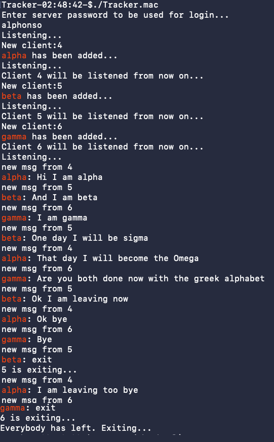

# Toy ChatServer

<p align="center">

</p>

This is a toy chat server. To use, just [dowload](https://github.com/piyush01123/Toy-ChatServer/releases/tag/binaries) and run the binaries as per your OS (Tested on MacOS and Ubuntu).

**Main ideas:** Multi-threading, Socket programming


## Compilation

To compile on Linux machines:
```
g++ tracker.cpp -lpthread -o Tracker.linux
g++ client.cpp -lpthread -o Client.linux
```

To compile on MacOS:
```
g++ -std=c++17 tracker.cpp -lpthread -o Tracker.mac
g++ -std=c++17 client.cpp -lpthread -o Client.mac
```

## Use this software
This runs on a client-server model. There should be just 1 tracker whereas there can be several clients. The machine running the tracker can be a client too. The client can join and leave as they wish. Just like whatsapp, a new client will be able to view messages in the group from the point she joins.

Run tracker:
```
./Tracker.linux
```

Run client with tracker's IP address as argument (must be on same network or else you will have to use a proxyserver):
```
./Client.linux $tracker_ip
```

## Snapshots
#### View from client 1 (alpha):


#### View from client 2 (beta):


#### View from client 3 (gamma):


#### View from tracker:


